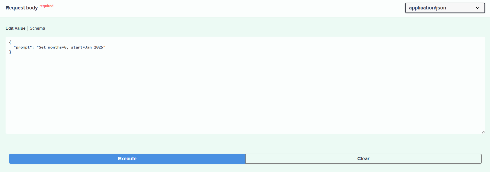
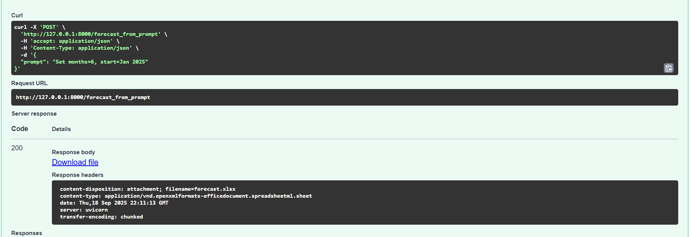

# AutoCFO – Financial Forecasting API

---

## Overview

AutoCFO is a FastAPI-based backend that generates financial forecasts in Excel format.
It uses:
- Rule-based logic with a knowledge base
- OpenAI GPT models for extracting structured parameters from natural language prompts

---

## Features
- Provide a text prompt, and GPT will extract parameters (months, CAC, marketing spend, etc.) → generates Excel forecast
- Returns downloadable .xlsx file
- Built with FastAPI + OpenAI + OpenPyXL

---

## Tech Stack
- Python 3.10+
- FastAPI – Web framework
- OpenAI Python SDK – AI completions
- OpenPyXL – Excel generation
- Uvicorn – ASGI server
- python-dotenv – Manage environment variables

---

## Setup
1. Clone the repository
```
git clone https://github.com/your-username/autocfo.git
cd autocfo
```
2. Create a virtual environment
```
python -m venv venv
source venv/bin/activate   # Mac/Linux
venv\Scripts\activate      # Windows
```
3. Install dependencies
```
pip install -r requirements.txt
```
Create a requirements.txt with:
```
fastapi
uvicorn
openai
python-dotenv
openpyxl
```

---

## Example Output
  
